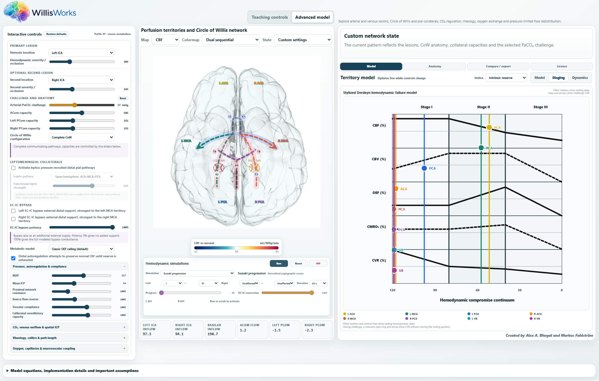
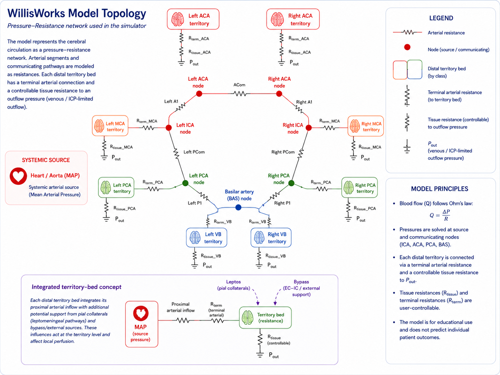
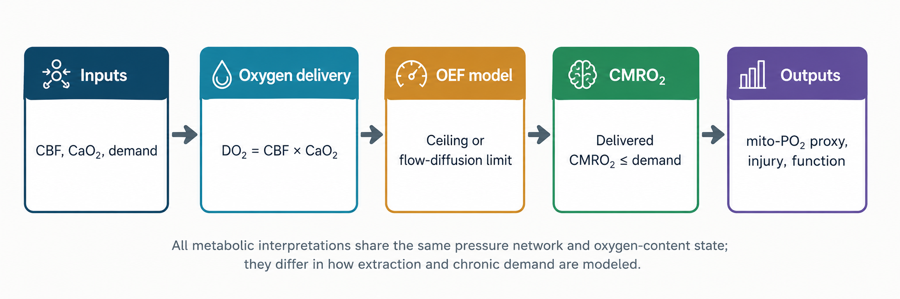
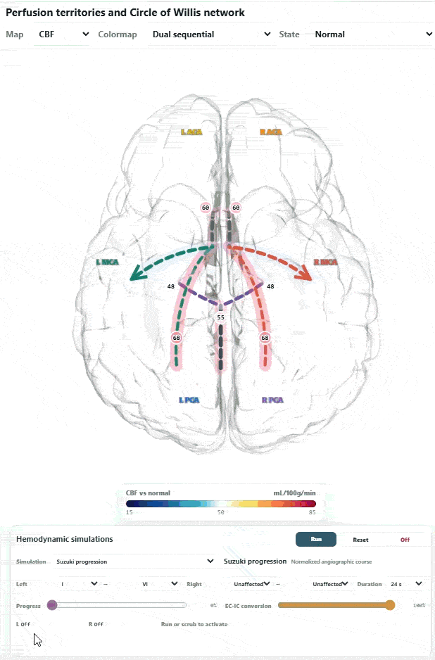

[](https://www.gnu.org/licenses/gpl-3.0)
[](https://abhogal-lab.github.io/WillisWorks/index.html)
# WillisWorks


## Simply download the WillisWorks.html file and open it in any broswer - or launch using the bottom below

[](https://abhogal-lab.github.io/WillisWorks/index.html)

[](https://github.com/abhogal-lab/WillisWorks)

## User and Physiological Model Manual

**Version 1.0 · July 2026**  
Interactive cerebral hemodynamics teaching simulator  
Software conceptualized by **Alex A. Bhogal** and **Markus Fahlström** with some help from our intern **openAI**

WillisWorks is a transparent conceptual laboratory for exploring how arterial anatomy, pressure, resistance, collateral pathways, venous outflow, oxygen exchange, and metabolic demand interact. It is an educational model—not a medical device, patient-specific digital twin, or clinical decision system.

**GPL-3.0-or-later · Browser-based · No patient data required**

**WillisWorks is a work in progress. Parameters may still be optimized and outputs should not be considered as accurate representations of physiology. This is intended as a conceptual tool only**

## How to use this manual
This document is both a user guide and a model specification. It follows
the equations and constants implemented in WillisWorks v1.0. The goal
is to let a reader understand what each control changes, why an output
moves, and which parts of that response are established physiology
versus educational calibration.

> **Code-fidelity note:** Numerical constants identified as calibrations or heuristics are listed in Appendix A rather than presented as universal physiological values.

### Model description
The numerical model contains eight tissue beds: bilateral ACA, MCA, PCA
and vertebrobasilar (VB) territories. The brain image paints six
cortical territories; L VB and R VB are present in the Model, Staging,
Dynamics, timelines, comparison tables and exports but are not painted
on the brain panel.

## Contents

1. [Purpose, scope and learning goals](#1-purpose-scope-and-learning-goals)
2. [Interface and recommended workflow](#2-interface-and-recommended-workflow)
3. [Model architecture](#3-model-architecture)
4. [Pressure, flow and outflow pressure](#4-pressure-flow-and-outflow-pressure)
5. [Autoregulation, PaCO₂ and compliance](#5-autoregulation-paco₂-and-compliance)
6. [Finite source reserve, proximal resistance and steal](#6-finite-source-reserve-proximal-resistance-and-steal)
7. [Circle of Willis, leptomeningeal pathways and bypass](#7-circle-of-willis-leptomeningeal-pathways-and-bypass)
8. [Rheology, geometry and venous physiology](#8-rheology-geometry-and-venous-physiology)
9. [Oxygen exchange, metabolism and neurovascular coupling](#9-oxygen-exchange-metabolism-and-neurovascular-coupling)
10. [Territory outputs, staging and Dynamics](#10-territory-outputs-staging-and-dynamics)
11. [Hemodynamic simulations](#11-hemodynamic-simulations)
12. [Feature and control quick reference](#12-feature-and-control-quick-reference)
13. [Interpretation, performance and limitations](#13-interpretation-performance-and-limitations)
14. [Appendix A: Assumption register and rationale](#appendix-a-assumption-register-and-rationale)
15. [Appendix B: Default values and ranges](#appendix-b-default-values-and-ranges)
16. [Appendix C: Glossary](#appendix-c-glossary)
17. [References](#references)

# 1. Purpose, scope and learning goals

_A conceptual laboratory for asking what changes, why it changes, and through which compensatory pathway._

WillisWorks is an interactive cerebral hemodynamics teaching simulator.
It links arterial anatomy, pressure loss, distal vascular tone,
communicating arteries, pial collateral pathways, venous outflow, oxygen
extraction and metabolic demand in one internally consistent
zero-dimensional model. Its purpose is not to reproduce a particular
patient, but to make otherwise abstract cerebrovascular mechanisms
visible, testable and discussable.

## Primary learning goals
- Understand why stenosis percentage alone does not determine perfusion:
  source pressure, lesion geometry, proximal resistance, CoW anatomy,
  collateral capacity and distal reserve all matter.

- Separate resting CBF from vasodilatory reserve. A territory can
  maintain near-normal flow while operating near its minimum arteriolar
  resistance.

- Understand bidirectional PaCO₂ regulation: hypocapnia constricts,
  hypercapnia dilates, and pressure-limited beds may show steal.

- Distinguish intrinsic territorial reserve from supported perfusion
  provided by CoW, pial or bypass pathways.

- Relate CBF and arterial oxygen content to OEF, delivered CMRO₂ and
  extraction limitations.

- Explore how source-flow reserve and proximal network resistance alter
  pressure redistribution.

- Recognize that staging labels are teaching summaries, not diagnostic
  classifications.

## Intended users and intended use
The simulator is intended for medical students, residents, radiologists,
neurologists, neurosurgeons, MRI scientists, physiologists and
researchers. It is useful for lectures, case discussions, experimental
design and hypothesis generation. It is not intended for diagnosis,
treatment selection, perioperative blood-pressure targets, quantitative
stroke-risk prediction, or replacement of measured perfusion, CVR, PET,
angiography or clinical examination.

> **Safe interpretation** Use the model to compare mechanisms and ask counterfactual questions. Do not infer that an individual patient shares the displayed absolute CBF, reserve or OEF value.

# 2. Interface and recommended workflow

_The interface is organized around interventions on the left, a visual map and simulations in the centre, and numerical interpretation on the right._



*Figure 1. Organization of the interface. Output calculations are expressed in the Model, Staging and Dynamics tabs.*

## A practical workflow
> **1.** Start from Restore defaults. Confirm PaCO₂ 38 mmHg, MAP 90 mmHg
> and symmetric territorial flow.
>
> **2.** Introduce one structural perturbation: a lesion, CoW variant,
> venous obstruction or altered proximal resistance.
>
> **3.** Inspect the Territory model before applying a challenge. Note
> distal pressure and intrinsic reserve even if CBF remains preserved.
>
> **4.** Use the PaCO₂ slider to compare hypocapnia, rest and
> hypercapnia. The local Reset beside Challenge and anatomy resets PaCO₂
> and ACom/PCom capacities only.
>
> **5.** Add CoW, leptomeningeal or bypass support one route at a time
> and compare state A versus B.
>
> **6.** Open Staging to summarize the current state. Open Dynamics to inspect 
> the autoregulatory compensation curve. Open Model to see quantitative outputs.
>
> **7.** A simulations tab below the brain provides a dynamic representation
> of flow and oef changes in response to increasing hemodynamic burden.
>
> **8.** Run a time-resolved simulation only after understanding the
> corresponding static state.

## Teaching controls and Advanced model
Teaching controls expose interventions that are easy to discuss
anatomically: lesions, PaCO₂, communicating arteries, CoW variants,
leptomeningeal pathways, bypass, metabolic interpretation and
autoregulation. Advanced model exposes pressure, source reserve,
compliance, venous physiology, rheology, geometry, oxygen exchange and
NVC parameters. Both modes modify the same underlying
state; switching modes does not reset the model.

## Reset behavior
|                                  |                                                                                                                                                   |
|----------------------------------|---------------------------------------------------------------------------------------------------------------------------------------------------|
| **Control**                      | **Scope**                                                                                                                                         |
| **Restore defaults**             | Restores the full startup state, including advanced physiology and all simulations. The selected interface view and Dynamics metric are retained. |
| **Challenge and anatomy: Reset** | Restores PaCO₂ to 38 mmHg, ACom to 50%, and both PCom capacities to 35%. It does not remove lesions or reset the rest of the model.               |
| **Simulation Reset**             | Returns the selected simulation to its start state while retaining the configured simulation type and settings.                                   |
| **Simulation Off**               | Removes simulation-specific modifiers and returns to the saved static base state.                                                                 |

# 3. Model architecture

_A steady lumped-parameter network with active distal resistance and separate oxygen/metabolic calculations._



*Figure 2. Simplified topology. Arterial sources and communicating pathways are represented by resistances; each distal bed has a terminal connection and controllable tissue resistance.*

## Numerical compartments
The model contains three arterial boundary sources (left ICA, right ICA
and basilar), seven proximal arterial nodes and eight distal beds. The
bilateral VB beds connect independently to the basilar node and compete
with both PCA beds for posterior inflow. They do not receive cortical
leptomeningeal or EC–IC bypass support.

## Why a zero-dimensional model?
A resistance network sacrifices spatial detail but makes pressure
redistribution, reserve and collateral dependence transparent.
Electrical-circuit and Windkessel analogies are widely used in
cardiovascular modeling [13,17,18]. The present solver is appropriate
for mechanism comparison, but it cannot reproduce patient-specific
geometry, local wall shear, three-dimensional jets, pulse-wave
propagation, collateral transit-time dispersion or infarct topology.

## Order of calculation
> **1.** Create arterial, communicating, pial, bypass and outflow
> resistances from the current controls.
>
> **2.** Solve nodal pressure and source inflow, including the finite
> source-reserve feedback when active.
>
> **3.** Iteratively update territorial arteriolar resistance toward the
> pressure-, metabolism- and PaCO₂-dependent flow target.
>
> **4.** Calculate collateral flows, source fractions, reserve and
> pressure readouts.
>
> **5.** Calculate oxygen delivery, extraction, delivered metabolism,
> CTH/shunt effects and the mitochondrial PO₂ proxy.
>
> **6.** Classify the state and update Model, Staging, Dynamics, map and
> export objects.

> **Equilibrium versus time** Most views show an equilibrium solution. Simulations add prescribed trajectories and simple response lags; the ordering of calculations should not be interpreted as the exact temporal order of physiological events in vivo.

# 4. Pressure, flow and outflow pressure

_Flow follows pressure gradients through a conductance network; territory-specific downstream pressure is the greater of local ICP and venous pressure._

## Conservation and nodal pressure
Each segment has hydraulic resistance R and conductance G = 1/R. At
every free node, inflow and outflow sum to zero. The resulting linear
system is solved for nodal pressures.

**Core network equations**

```text
Σj Gij(Pi − Pj) + Gi,source(Pi − Psource) + Gi,sink(Pi − Pout)= 0
Qterritory = k · max(Pdistal − Pout, 0) / Rtissue
```

The scale factor k is calibrated so that the symmetric default state
produces approximately 50 mL/100 g/min in each bed at MAP 90 mmHg and
ICP 10 mmHg. Internal resistance values are therefore normalized model
units rather than directly measured mmHg·min·100 g/mL.

## Territory-specific outflow pressure
A territory first receives a local ICP that may include lateral and posterior
gradients. Venous obstruction increases local effective venous pressure.
The downstream pressure used for flow is the larger of the two,
consistent with a simplified vascular-waterfall or Starling-resistor
concept [17,18].

**Outflow and perfusion pressure**

```text
PIClocal,t = ICP + lateral offsett + posterior offsett
Pvenous,t = CVP + obstruction incrementt
Pout,t = max(PIClocal,t, Pvenous,t)
CPPt = Pdistal,t − Pout,t
```

## Stenosis and near-occlusion
Stenosis severity is translated into a viscous resistance term plus a
bounded inertial/jet-loss term. The relation becomes steep near 95–100%
so that near-occlusion is possible without numerically disconnecting a
node.

**Implemented lesion mapping**

```text
Rviscous = 3.2s², s < 0.95
Rviscous = 3.2(0.95)² + 220[(s−0.95)/0.05]³, s ≥ 0.95
Rjet = min{85, 0.055s² / max(1−s,0.025)²}
Rlesion = Rviscous + Rjet
```

> **Important assumption** This is not a clinical conversion from angiographic percent stenosis to pressure loss. Real pressure loss depends on lumen geometry, length, eccentricity, flow rate, separation, collateral demand and rheology.

# 5. Autoregulation, PaCO₂ and compliance

_The healthy reference is a gently sloped CPP-based standard; territorial curves emerge from actual pressure loss, target flow and available resistance range._


*Figure 3. Pressure-only autoregulatory reference profiles for each territory.*

## Healthy reference and pressure controller
The familiar 60–150 mmHg MAP range is retained as a labeled healthy
reference at ICP 10 mmHg. It is expressed internally in CPP space and
has a gentle slope rather than a perfectly horizontal plateau [1–3].

|                               |          |                   |         |
|-------------------------------|----------|-------------------|---------|
| **Reference point**           | **CPP**  | **MAP at ICP 10** | **CBF** |
| **Lower operational knee**    | 50 mmHg  | 60 mmHg           | 47.5    |
| **Preferred operating point** | 80 mmHg  | 90 mmHg           | 50.0    |
| **Upper operational knee**    | 140 mmHg | 150 mmHg          | 52.5    |

For each territory, the controller calculates the resistance required to
reach its current target flow and moves from the reference resistance
toward that value. The result is constrained by calibrated minimum and
maximum resistance.

**Territorial autoregulation**

```text
Rrequired = (Pdistal − Pout) / (CBFtarget / k)
Rcontroller = Rreference + EAR(Rrequired − Rreference)
Rarteriole = clamp(Rcontroller, Rmin, Rmax)
```

## Metabolic and NVC flow target
The pressure-only reference is scaled by the flow required to support
metabolic demand at a preferred OEF of 0.40. Neural activation increases
both represented demand and a feed-forward flow request; NVC efficiency
and endothelial function determine how strongly the flow component is
expressed [9–12,21]. Parameters can be modified under the Advanced Model 
controls (Oxygen, capillaries & neurovascular coupling).

**Metabolic targeting**

```text
Demand scale = 1 + 0.25 · neural activation
NVC flow scale = 1 + 0.30 · activation · NVC efficiency · endothelial
function
CBFmetabolic = clamp[CMRO₂demand/(CaO₂ · 0.40) · NVC flow scale, 35,
95]
CBFtarget(MAP) = CBFreference(MAP) · CBFmetabolic / 50
```

## Unified PaCO₂ regulation
PaCO₂ is the only global vasoactive challenge. A sigmoid is used because
the human CBF–CO₂ response flattens at hypocapnic and hypercapnic
extremes rather than remaining indefinitely linear [6–8]. Rest is
defined at 38 mmHg, between common resting values and close to the
reported midpoint of the human response.

**CO₂ sigmoid and normalized tone**

```text
S(PaCO₂) = 1 / {1 + exp[−(PaCO₂−38)/6]}
Fraw = 0.55 + 0.90S
FCO₂ = Fraw / Fraw(38)
Tone request = (FCO₂ − 1) · endothelial function · stiffness
efficiency
```

PaCO₂ above 38 mmHg lowers resistance toward Rmin; PaCO₂ below 38 mmHg
raises resistance toward Rmax. In a pressure-limited bed that is already
near Rmin, healthy donor beds may dilate more strongly and produce steal
[8].

## Profiles and compliance
|                             |                                                                                |                                                                                         |
|-----------------------------|--------------------------------------------------------------------------------|-----------------------------------------------------------------------------------------|
| **Setting**                 | **Implementation**                                                             | **Interpretation**                                                                      |
| **Normal autoregulation**   | Normal CPP reference, full controller efficiency.                              | Symmetric default curves overlap the grey healthy reference.                            |
| **Chronic hypertension**    | CPP reference points 70/100/165 mmHg.                                          | Literature-informed right shift; not patient-specific [4].                            |
| **Impaired autoregulation** | Controller efficiency 0.28.                                                    | More pressure-passive, sloped response.                                                 |
| **Autoregulation off**      | Controller efficiency 0 and fixed active resistance.                           | Demonstrates pressure-passive flow.                                                     |
| **Low compliance**          | Narrows active range, reduces controller and challenge efficiency, alters lag. | Represents stiffness-associated damping loss and modest vascular dysfunction [13–15]. |

# 6. Finite source reserve, proximal resistance and steal

_Steal becomes prominent when additional vasodilatory demand approaches the flow reserve of the supplying ICA or basilar source._


*Figure 4. A vasoactive stimulus leads to vascular steal in the left territories due to competition for limited inflow supply.*

## Why finite source reserve was added
With fixed-pressure sources and purely linear proximal resistance,
healthy territories can often obtain more flow during hypercapnia
without substantially lowering pressure in a compromised bed. This
biases the model toward increased total inflow and limits steal. Human
and conceptual MRI work emphasizes that redistribution becomes important
when major-vessel flow capacity is constrained [8].

## Source-flow-reserve model
Each source—left ICA, right ICA and basilar—has a healthy reference
capacity calibrated at 1.75 times its healthy resting inflow. During a
challenge, the model treats the current collateral-supported resting
inflow as the baseline and applies the capacity limit to additional
acute demand.

**Source reserve**

```text
Qcap,s = Qrest,s + Fcapacity · (Qcap,healthy,s −
Qhealthy,rest,s)
us = max(Qs − Qrest,s, 0) / max(Qcap,s − Qrest,s, ε)
ΔPsource = soft-knee(us), beginning at u = 0.65
Psource,effective = Psource − ΔPsource
```

The pressure-drop request is 8·knee³ below the reference capacity and
gains linear and quadratic terms after utilization exceeds 100%; drop
is capped at 78% of the available source-to-outflow pressure. This is a
soft knee, not a hard flow clamp.

## Proximal network resistance
The proximal-resistance slider scales native ICA/basilar inlet, A1, M1,
P1 and terminal arterial resistances. It does not override ACom, PCom,
pial or lesion-specific resistance. Increasing it magnifies pressure
loss for a given flow change and makes competition among beds more
visible.

## Interpreting steal
True modeled steal is a fall in territorial CBF relative to its own
static resting state during vasodilation elsewhere. It is most likely when the
recipient bed has little remaining dilation, depends on a limited
collateral route, and shares a source whose acute reserve is being used.
A complete occlusion is not necessarily the strongest steal state: some
resting collateral flow must remain available to be redistributed.

> **MRI caution** Negative BOLD CVR is not identical to true CBF steal, and single-delay ASL can underestimate flow when arterial transit time changes. Compare the model primarily with quantitative, delay-aware flow measurements when possible.

# 7. Circle of Willis, leptomeningeal pathways and bypass

_Primary, secondary and external support pathways are represented separately so their pressure and reserve consequences can be compared._

## ACom and PCom pathways
Communicating-artery flow follows the solved pressure gradient. Capacity
sliders alter pathway resistance; zero capacity makes a path
functionally absent. Named CoW variants modify selected A1, P1 or source
resistances. These controls represent functional conductance rather than
a measured diameter [22–24].

**CoW capacity mapping**

```text
Rcommunicating(c) = 0.16 + 20(1−c)²
Qcommunicating = k(Pdonor − Precipient) / Rcommunicating
```

## Leptomeningeal recruitment
Pial templates link ACA–MCA, MCA–PCA and a weaker ACA–PCA route in each
hemisphere. The transhemispheric option adds an ACA bridge. Conductance
is recruited from the resting distal pressure difference, consistent
with the directional importance of pressure gradients but not with a
universal measured threshold [22,23].

**Resting pial conductance**

```text
Recruitment = smoothstep[(|ΔPrest| − 3.5 mmHg) / 12 mmHg]
Rpial = edge factor · [0.42 + 10(1−capacity)²]
Edge factors: ACA–MCA 1.00; MCA–PCA 1.10; ACA–PCA 2.50; trans-ACA
1.35
```

## Fixed acute conductance and the 65/35 split
In an acute PaCO₂ challenge, a vessel recruited at rest should not
disappear instantly because the pressure gradient changes. The model
therefore retains 65% of established resting pial flow and lets 35%
remain pressure responsive. This avoids counting donor competition twice
while still allowing collateral flow to weaken or reverse.

**Acute pial flow**

```text
Qpial,acute = 0.65Qpial,rest + 0.35 · kΔPacute/Rpial
```

> **Teaching calibration** The 3.5-mmHg onset, 12-mmHg recruitment span, edge weights and 65/35 split were selected for stable, interpretable rescue and redistribution. They are not universal human thresholds.

## EC–IC bypass
Bypass adds an external distal pressure source, strongest to the MCA bed
and weaker to ipsilateral ACA and PCA beds. At default hyperemia, the
source pressure is approximately MAP−2 mmHg. Resistance weights are
0.34/potency for MCA, 0.94/potency for ACA and 1.02/potency for PCA. VB
beds are not supplied. This is a teaching model of functional pressure
support, not a graft-flow or surgical-outcome calculation [30].

# 8. Rheology, geometry and venous physiology

_Resistance is allowed to vary with haematocrit, apparent viscosity, representative diameter, path length and outflow pressure (experimental modeling)._

## Haematocrit and apparent viscosity
Large-vessel viscosity is represented by a normalized
haematocrit-dependent factor. Microvascular apparent viscosity uses a
Pries-type relationship at a representative diameter of 38 μm,
normalized to Hct 0.42 [16].

**Rheology and Poiseuille-like geometry**

```text
Rgeometry ∝ μapparent(Hct,D) · L / D⁴
Large-vessel viscosity proxy = (1 + 2.5Hct) / (1 + 2.5·0.42)
Representative microvascular diameter = 38 μm · diameter scale
```

The D⁴ dependence makes the diameter slider intentionally powerful. It
is a representative global calibre control, not a literal uniform change
in every vessel.

## Compliance-dependent calibre
A small pressure strain changes representative diameter as MAP moves
from 90 mmHg. The strain is attenuated by the stiffness index and
clamped to prevent extreme geometry. This creates a modest static
wall-mechanics effect without a full pressure–area or viscoelastic
model.

**Pressure-dependent calibre**

```text
Strain = 0.035 · compliance · (MAP−90)/50 ·
(1−0.65·stiffness)
Diameter multiplier is clamped to 0.60–1.45; path length to
0.60–1.80
```

## Venous obstruction and spatial ICP
CVP is normally below ICP and therefore may not set the effective
outflow pressure. Venous obstruction can add up to 15 mmHg to selected
territories. Lateral and posterior ICP gradients are applied before
taking the maximum of venous and local ICP pressure. This permits
asymmetric or posterior pressure limitation, but it is not a venous
sinus network and does not model venous collateral channels [17,18].

# 9. Oxygen exchange, metabolism and neurovascular coupling

_Both metabolic modes share Fick balance and the same arterial network, but differ in how extraction capacity is represented._



*Figure 5. Shared oxygen cascade (experimental modeling). CTH, shunt and endothelial/NVC settings alter exchange or flow demand before derived metrics are calculated.*

## Arterial oxygen content and Fick balance
The oxygen simulation derives arterial oxygen content from haemoglobin
and saturation; the Advanced CaO₂ control sets content directly. The
dissolved term is fixed because PaO₂ is not independently modeled [9].

**Oxygen content and Fick balance**

```text
CaO₂ [mL O₂/mL] = [1.34·Hb(g/dL)·SaO₂ + 0.30] / 100
DO₂ = CBF · CaO₂
OEFrequired = CMRO₂demand / DO₂
CMRO₂delivered = min(CMRO₂demand, DO₂ · OEF)
```

## Capillary transit-time heterogeneity and shunt
CTH reduces the attainable extraction fraction when capillary transit
times become more heterogeneous; a functional shunt removes a fraction
of flow from exchange. These effects are motivated by capillary-flow
models showing that heterogeneous transit can reduce oxygen extraction
efficacy [19,20].

**Implemented exchange penalties**

```text
CTH penalty = 1 / [1 + 0.48(CTH−1)^1.25], for CTH ≥ 1
Effective OEFmax = OEFmax · CTH penalty · (1−0.55·shunt)
Exchange flow = CBF · (1−shunt)
```

## Two metabolic interpretations
|                            |                                                                                     |                                                                                |
|----------------------------|-------------------------------------------------------------------------------------|--------------------------------------------------------------------------------|
| **Model**                  | **Core rule**                                                                       | **Best use / caution**                                                         |
| **Classic OEF ceiling**    | OEF rises to the effective selected ceiling; delivered CMRO₂ is delivery × OEF.     | Clear demonstration of compensated hypoperfusion and metabolic failure.        |
| **Flow–diffusion reserve** | OEF = 1−exp(−D/flow); D is capped by a normalized diffusivity reserve.              | Shows that extraction depends on transport capacity [10–12].                 |

## Mitochondrial PO₂ proxy
The displayed mitochondrial PO₂ is a bounded teaching proxy derived from
oxygen-delivery margin, extraction stress and CTH penalty. It is not
calculated from tissue diffusion geometry, capillary PO₂ distributions
or mitochondrial respiration kinetics.

**Derived proxy**

```text
Capacity = DO₂ · effective OEFmax
Mito-PO₂ proxy = clamp[20 + 12·oxygen margin + 12(1−extraction stress) −
8(1−CTH penalty), 0, 45]
```

## Neurovascular coupling and endothelial function
Neural activation increases demand by up to 25% and requests up to 30%
additional flow before NVC and endothelial scaling. Endothelial function
also attenuates CO₂ reactivity. This makes metabolic demand,
feed-forward coupling and vascular responsiveness separable, while
remaining a simplified abstraction of the neurovascular unit [21].

# 10. Territory outputs, staging and Dynamics

_Begin with continuous pressure, flow and reserve; use categorical labels as summaries rather than as endpoints._

## Territory model
Each of the eight territory rows reports CBF, OEF, delivered CMRO₂, a
state badge, intrinsic and available reserve, source composition and
small CBF/OEF/CMRO₂ histories. The wide CBF bar provides a rapid visual
comparison. Intrinsic reserve uses a violet palette; available reserve
uses green. Hyperemia is shown in green, whereas metabolic failure
remains red.

## Intrinsic versus available reserve
Intrinsic reserve measures unused vasodilatory range in the territorial
bed. Available reserve additionally reflects current support from
communicating, pial, bypass and ECA pathways. A collateralized bed can
therefore maintain adequate supported perfusion while remaining
intrinsically exhausted and donor dependent.

## Staging rules
|                               |                                                 |                                                                      |
|-------------------------------|-------------------------------------------------|----------------------------------------------------------------------|
| **State**                     | **Implemented rule**                            | **Meaning**                                                          |
| **Normal**                    | Reserve ≥0.55; CBF 45–57; no metabolic deficit. | Default teaching range.                                              |
| **Reduced reserve**           | Reserve \<0.55.                                 | Compensation is being used.                                          |
| **Stage I / exhausted**       | Reserve \<0.18.                                 | Bed is close to minimum resistance.                                  |
| **Compensated hypoperfusion** | CBF \<45 without Stage-II OEF elevation.        | Low flow with incomplete or model-dependent extraction response.     |
| **Stage II**                  | CBF \<45 and OEF \> normal OEF +0.08.           | Elevated extraction supports metabolism [25,26].                   |
| **Metabolic failure**         | Delivered CMRO₂ \<95% of represented demand.    | Selected extraction capacity cannot meet demand.                     |
| **Hyperemic response**        | CBF \>57.                                       | Flow above the reference range; displayed as a positive green state. |

All categorical boundaries are WillisWorks teaching rules and are not
PET diagnostic cutoffs.

**Stages are representative and are meant for teaching/visualization purposes only**

## Dynamics
Dynamics is independent of the active simulation. The View dropdown
selects Autoregulation curve, Suzuki progression, Steno-occlusive
progression or Oxygen delivery. The Metric dropdown retains CBF, OEF,
CMRO₂, intrinsic/available reserve, distal pressure, mitochondrial PO₂
proxy. Full curves use 43 samples and include the exact current operating
point; a 17-point
preview is used while dragging.

# 11. Hemodynamic simulations

_Time-resolved demonstrations built from the same static network. Playback time is pedagogical, not biological disease time._

## General behavior
Run advances the selected trajectory; Reset returns it to the start; Off
removes its modifiers. The progress slider allows manual inspection.
Timeline metrics are stored as the trajectory advances. Dynamics remains
user selected and is no longer forced to follow the active simulation.

## Suzuki progression


*Figure 6. Normalized Suzuki anchor functions. Continuous trajectories interpolate between these grade anchors.*

Moyamoya disease involves progressive terminal ICA steno-occlusion and
evolving basal, posterior and external collateral pathways. Suzuki and
Takaku described six angiographic stages [27–29]. WillisWorks uses
independent left and right start/end grades. Interpolation modifies ICA
and branch severity, basal collateral support, posterior recruitment,
PCA burden and ECA support. EC–IC conversion scales the external
component.

> **Interpretation** Angiographic grade is not equivalent to perfusion, symptoms or progression rate. The anchor values reproduce a recognizable sequence; they are not longitudinal measurements or probabilities.

## Blood pressure and autoregulation
Select Normal, Chronic hypertension or Impaired autoregulation and
specify start/end MAP. Commanded MAP is transmitted through a
compliance-dependent first-order lag: τ = 0.55 + 1.65·relative
compliance seconds. At each step the complete pressure network and
resistance controller are solved. The same equilibrium law is used in
both directions; the lag provides history but not a full dynamic
autoregulation model [1,5].

## Steno-occlusive progression
Progress raises the selected M1, ICA or tandem lesion smoothly toward
98%. The optional collateral-adaptation slider begins after early
disease and increases CoW and pial capacity according to a normalized
trajectory. This is a simulation-specific educational modifier, not the
removed chronic remodeling module. Watch reserve fall before resting CBF
and compare ICA versus M1 location.

## Oxygen delivery
Anaemia changes haemoglobin, hypoxaemia changes SaO₂, and increased
demand changes CMRO₂. A smooth progression recalculates CaO₂, metabolic
target flow, extraction and delivered metabolism. The model does not
include systemic cardiac-output, ventilatory, 2,3-DPG or transfusion
effects; it isolates cerebral oxygen-content mechanisms [9].

|                                 |                                                          |                                                                    |
|---------------------------------|----------------------------------------------------------|--------------------------------------------------------------------|
| **Simulation**                  | **Primary controls**                                     | **Best metric to watch**                                           |
| **Suzuki progression**          | Left/right grade trajectory, duration, EC–IC conversion. | Intrinsic vs available reserve; source fractions; distal pressure. |
| **Pressure & autoregulation**   | Profile, start/end MAP, compliance.                      | CBF and distal pressure; compare falling vs rising sweeps.         |
| **Steno-occlusive progression** | Side, M1/ICA/tandem, adaptation, duration.               | Reserve before CBF; donor-recipient asymmetry.                     |
| **Oxygen delivery**             | Anaemia, hypoxaemia or demand; metabolic model.          | CaO₂, OEF, delivered CMRO₂ and mito-PO₂ proxy.                     |

# 12. Feature and control quick reference

_Controls are grouped by the mechanism they modify. Defaults and exact ranges are tabulated in Appendix B._

## Teaching controls
|                              |                                                                        |                                                                             |
|------------------------------|------------------------------------------------------------------------|-----------------------------------------------------------------------------|
| **Control**                  | **What it changes**                                                    | **Use**                                                                     |
| **Primary / second lesion**  | Adds independent resistance to ICA, M1, A1, P1 or basilar segments.    | Build unilateral, bilateral or tandem disease; increase severity gradually. |
| **PaCO₂ challenge**          | Sets arterial PaCO₂ from hypocapnia through hypercapnia.               | Test constriction, dilation, reserve and steal. Rest is 38 mmHg.            |
| **ACom / PCom capacity**     | Changes functional communicating-artery conductance.                   | Test anterior cross-filling and anterior–posterior redistribution.          |
| **CoW configuration**        | Applies named A1/P1/PCom/source-resistance variants.                   | Use one anatomical pattern at a time.                                       |
| **Activate leptos**          | Adds recruited cortical pial links.                                    | Compare recipient rescue, donor burden and acute challenge response.        |
| **Lepto pattern / strength** | Selects ipsilateral or transhemispheric links and functional capacity. | Treat as conductance, not angiographic collateral grade.                    |
| **L/R EC–IC bypass**         | Adds an external distal pressure source.                               | Compare pre/post support; not a surgical-outcome predictor.                 |
| **Metabolic model**          | Classic or Flow–diffusion.                                             | Choose the oxygen-extraction interpretation.                                |
| **Autoregulation**           | Enables or disables active distal resistance control.                  | Disable to demonstrate pressure-passive flow.                               |

## Advanced controls: pressure and circulation
|                                 |                                                                          |                                                           |
|---------------------------------|--------------------------------------------------------------------------|-----------------------------------------------------------|
| **Control**                     | **Effect**                                                               | **Caution**                                               |
| **MAP**                         | Changes arterial boundary pressure.                                      | Does not include systemic baroreflex or cardiac output.   |
| **ICP, CVP and gradients**      | Change territory-specific effective outflow pressure.                    | Reduced venous/Starling abstraction, not a sinus network. |
| **Proximal network resistance** | Scales native inlet and A1/M1/P1/terminal resistance.                    | Independent of CoW and pial controls.                     |
| **Source flow reserve**         | Scales acute capacity above the current resting inflow.                  | Soft pressure-drop calibration, not measured Qmax.       |
| **Vascular compliance**         | Changes pulse damping, MAP lag and stiffness-associated active function. | Relative index, not physical compliance units.            |
| **Vasodilatory capacity**       | Scales distance from reference resistance to Rmin.                       | 100% reproduces calibrated healthy capacity.              |
| **Venous obstruction**          | Raises local venous outflow pressure.                                    | Location categories are simplified.                       |

## Advanced controls: rheology, oxygen and coupling
|                                        |                                                          |                                                                   |
|----------------------------------------|----------------------------------------------------------|-------------------------------------------------------------------|
| **Control**                            | **Effect**                                               | **Caution**                                                       |
| **Haematocrit**                        | Changes large- and microvascular apparent viscosity.     | Does not include all systemic responses to anaemia/polycythaemia. |
| **Diameter / path length**             | Scales representative geometry and resistance.           | Global proxy; D⁴ makes diameter highly influential.               |
| **CMRO₂ / CaO₂**                       | Change metabolic demand, delivery and target flow.       | High target flow is clamped at 95.                                |
| **OEF ceiling / diffusivity reserve**  | Limit extraction in Classic or Flow–diffusion models.    | Normalized capacities, not patient measurements.                  |
| **CTH / shunt**                        | Reduce effective extraction and exchange flow.           | Reduced exchange penalties, not capillary-network simulation.     |
| **Neural activation / NVC efficiency** | Separate demand and feed-forward flow components.        | Simplified whole-territory NVC.                                   |
| **Endothelial function**               | Attenuates CO₂ reactivity, NVC and challenge efficiency. | Aggregate functional index.                                       |

## Display, comparison and export
|                                |                                                                                            |
|--------------------------------|--------------------------------------------------------------------------------------------|
| **Control**                    | **Function**                                                                               |
| **Map metric and palette**     | Colours six cortical territories; always read the colourbar.                               |
| **Preset state**               | Loads a complete teaching state; manual edits change it to Custom.                         |
| **Model / Staging / Dynamics** | Switches fixed-height right-panel representations.                                         |
| **Dynamics View**              | Selects autoregulation, Suzuki, stenosis or oxygen series independently of the simulation. |
| **Dynamics Metric**            | Selects CBF, OEF, CMRO₂, reserve, pressure or mitochondrial PO₂ proxy.                    |
| **Save state A / B**           | Stores two current states in browser memory for comparison.                                |
| **PNG / CSV / JSON**           | Exports the map, territorial results or full parameter/result object.                      |

# 13. Interpretation, performance and limitations

_A plausible output is a model prediction under its assumptions, not evidence that the same quantitative response occurs in vivo._

## How to interpret a surprising result
> **1.** Check effective outflow pressure and distal arterial pressure
> before looking only at CBF.
>
> **2.** Check intrinsic reserve: preserved flow may already require
> near-maximal dilation.
>
> **3.** Check source-reserve utilization and proximal resistance when
> challenge responses appear too small or steal appears strong.
>
> **4.** Check whether collateral support raises absolute flow even if
> CVR relative to the rescued baseline remains negative.
>
> **5.** Check CaO₂, demand, CTH, shunt and OEF ceiling before calling a
> low CMRO₂ value pressure failure.
>
> **6.** Use A/B comparison and change one mechanism at a time.


## Major limitations
- No patient-specific vessel geometry, measured flow boundary conditions
  or parameter fitting.

- No one-dimensional wave propagation, inertance, full pulse-wave
  reflections or cardiac-output model.

- No spatial capillary network, venous sinus network, true tissue PO₂
  diffusion or mitochondrial kinetics.

- No validated conversion from angiographic stenosis percentage,
  collateral grade or bypass potency to hydraulic resistance.

- No grey/white-matter or border-zone subcompartments; focal severe
  steal can therefore be averaged within a territory.

- No explicit transit-time effect on ASL signal and no BOLD biophysical
  signal model.

- No embolic mechanism, infarct-core evolution or patient-specific
  neuronal injury model.

- Simulation durations and progression anchors are pedagogical, not
  biological time scales.

> **Responsible use** WillisWorks is most valuable when its assumptions are made explicit. The appendix below is intentionally detailed so users can identify which conclusions are robust to model structure and which depend on a calibration choice.

# Appendix A: Assumption register and rationale

_A systematic audit of defaults, formulas, thresholds and structural choices implemented in v21j._

The tables below distinguish physiological principles from reduced
abstractions and WillisWorks-specific calibrations. “Why chosen”
describes the implementation rationale, not a claim that the value is
universally normal.

## A1. Baseline state and normalization
|                          |                                 |                                                                                                       |                                                                   |
|--------------------------|---------------------------------|-------------------------------------------------------------------------------------------------------|-------------------------------------------------------------------|
| **Implementation**       | **Status**                      | **Why chosen / link to physiology**                                                                   | **Limit or sensitivity**                                          |
| **MAP 90 mmHg**          | Literature-informed default     | A recognizable normotensive operating point and the preferred point of the healthy reference [1–3]. | Not a universal individual MAP or optimal clinical target.        |
| **ICP 10 mmHg**          | Literature-informed default     | Common normal teaching value; maps CPP 80 to MAP 90.                                                  | ICP varies with posture, pathology and measurement site.          |
| **CVP 5 mmHg**           | Teaching default                | Keeps venous pressure below ICP in the default Starling-resistor state [17,18].                     | No respiratory or right-heart dynamics.                           |
| **PaCO₂ 38 mmHg**        | Literature-informed calibration | Close to resting human values and near the midpoint of the sigmoid CBF–CO₂ response [6].            | PaCO₂ and end-tidal CO₂ are not interchangeable in every subject. |
| **CBF 50 mL/100 g/min**  | Teaching normalization          | A familiar whole-brain reference used to set k and compare territories.                               | Grey/white matter and regional baseline flow differ.              |
| **CMRO₂ 4.0; CaO₂ 0.20** | Literature-informed defaults    | Their ratio at preferred OEF 0.40 gives target CBF 50 [9–12].                                       | Units and values are representative, not subject-specific.        |
| **Hct 0.42**             | Teaching normalization          | Reference for normalized apparent viscosity [16].                                                   | Sex, age and microvascular discharge haematocrit differ.          |

## A2. Pressure and resistance network
|                                                         |                                 |                                                                                            |                                                                             |
|---------------------------------------------------------|---------------------------------|--------------------------------------------------------------------------------------------|-----------------------------------------------------------------------------|
| **Implementation**                                      | **Status**                      | **Why chosen / link to physiology**                                                        | **Limit or sensitivity**                                                    |
| **Three fixed MAP boundary sources**                    | Mechanistic abstraction         | Separates L ICA, R ICA and basilar contributions and allows CoW redistribution.            | No cardiac output or measured source-flow waveforms.                        |
| **Seven proximal nodes / eight beds**                   | Structural abstraction          | Minimum topology that preserves bilateral ACA/MCA/PCA/VB interactions.                     | No border-zone or grey/white-matter subbeds.                                |
| **BASE source .18, segment .12, terminal .05, bed .83** | WillisWorks calibration         | Places most healthy pressure control distally while preserving meaningful proximal losses. | Internal normalized units; ratios strongly influence redistribution.        |
| **Flow clamped at zero below outflow pressure**         | Physical safeguard              | Prevents nonphysical negative sink flow in the reduced tissue-bed equation.                | Does not model venous reflux or vascular collapse in detail.                |
| **Pout=max(ICP,CVPlocal)**                              | Literature-informed abstraction | Captures a vascular-waterfall / Starling-resistor concept [17,18].                       | No explicit venous sinus/collateral network.                                |
| **Venous obstruction adds up to 15 mmHg**               | Teaching calibration            | Produces visible regional outflow limitation over the slider range.                        | Not a conversion from stenosis grade or sinus pressure measurement.         |
| **Spatial ICP offsets**                                 | Experimental abstraction        | Allows left/right and posterior pressure heterogeneity to be explored.                     | True intracranial pressure fields are continuous and coupled to compliance. |

## A3. Lesions, geometry and rheology
|                                       |                                          |                                                                                |                                                                    |
|---------------------------------------|------------------------------------------|--------------------------------------------------------------------------------|--------------------------------------------------------------------|
| **Implementation**                    | **Status**                               | **Why chosen / link to physiology**                                            | **Limit or sensitivity**                                           |
| **3.2s² stenosis term**               | Heuristic                                | Provides gradual resistance growth at moderate severity.                       | Not Poiseuille flow through the measured residual lumen.           |
| **Cubic rise above 95%**              | Numerical/teaching calibration           | Creates a transition to near-occlusion without singular disconnection.         | Results near 95–100% are highly sensitive to lesion mapping.       |
| **Jet term with cap 85**              | Reduced-order heuristic                  | Adds flow-separation/inertial loss and prevents overflow.                      | No lesion length, eccentricity or Reynolds-number calculation.     |
| **R∝μL/D⁴**                           | Established relation used as abstraction | Preserves the dominant geometry dependence of laminar tube flow.               | Cerebral networks are branching, compliant and nonuniform.         |
| **38-μm representative microvessel**  | Teaching calibration                     | Places the apparent-viscosity function in a small-vessel regime [16].        | One diameter cannot represent arterioles, capillaries and venules. |
| **Pressure strain coefficient 0.035** | Heuristic wall-mechanics coupling        | Adds modest pressure-dependent calibre without overwhelming active resistance. | Not a measured pressure–area curve.                                |
| **Diameter clamp 0.60–1.45**          | Numerical safeguard                      | Prevents D⁴ from producing implausible singular resistance.                    | Clipping can dominate extreme slider combinations.                 |

## A4. Autoregulation and PaCO₂
|                                 |                                 |                                                                                           |                                                                      |
|---------------------------------|---------------------------------|-------------------------------------------------------------------------------------------|----------------------------------------------------------------------|
| **Implementation**              | **Status**                      | **Why chosen / link to physiology**                                                       | **Limit or sensitivity**                                             |
| **CPP points 50/80/140**        | Literature-informed calibration | Maps to the familiar 60/90/150 MAP reference at ICP 10 [1–3].                           | Individual limits and plateau slope vary.                            |
| **CBF 47.5/50/52.5**            | WillisWorks calibration         | Defines ±5% operational knees while retaining a gentle plateau slope.                     | Not a biological threshold or confidence interval.                   |
| **Hypertension CPP 70/100/165** | Literature-informed calibration | Represents a right-shifted operating range described in severe hypertension [4].        | Not a universal chronic-hypertension profile.                        |
| **Impaired efficiency 0.28**    | Teaching calibration            | Produces a visibly pressure-passive but not completely unregulated curve.                 | No direct clinical conversion.                                       |
| **Preferred OEF 0.40**          | Literature-informed abstraction | Links demand and content to flow through Fick balance [9–12].                           | Regional OEF varies.                                                 |
| **Target-flow clamp 35–95**     | Numerical/teaching bound        | Prevents unlimited metabolic flow request while allowing strong NVC/hypoxic compensation. | Current code uses 95;                  |
| **CO₂ midpoint 38, slope 6**    | Literature-informed calibration | Produces a human-like sigmoid with bounded hypocapnic and hypercapnic limbs [6–8].      | Not fit to a specific subject or gas-delivery protocol.              |
| **Raw CO₂ range 0.55–1.45**     | WillisWorks calibration         | Allows substantial constriction/dilation while remaining bounded.                         | Absolute CVR depends on endothelial, stiffness and reserve settings. |

## A5. Compliance and source-flow reserve
|                                           |                                                  |                                                                                               |                                                               |
|-------------------------------------------|--------------------------------------------------|-----------------------------------------------------------------------------------------------|---------------------------------------------------------------|
| **Implementation**                        | **Status**                                       | **Why chosen / link to physiology**                                                           | **Limit or sensitivity**                                      |
| **Windkessel τ coefficient 0.18**         | Teaching calibration on established model family | Creates visible but compact pulse damping [13].                                             | Not physical compliance units or a distributed arterial tree. |
| **Systemic pulse pressure 40 mmHg; 1 Hz** | Teaching references                              | Provide a stable reference for relative distal pulse transmission.                            | No heart-rate or waveform control.                            |
| **Stiffness couplings 20%, 18%, 30%**     | Heuristic empirical coupling                     | Separates passive damping from modest loss of active regulation/challenge capacity [14,15]. | Human associations are variable and confounded.               |
| **Source headroom 1.75× healthy rest**    | WillisWorks calibration                          | Leaves substantial healthy reserve but permits capacity-limited steal at high demand [8].   | Not measured ICA or basilar maximum flow.                     |
| **Soft knee at 65% acute reserve**        | Teaching calibration                             | Allows pressure drop to emerge before a hard capacity limit.                                 | Steal magnitude is sensitive to this knee.                    |
| **drop terms 8 / 35 / 60**               | Heuristic nonlinear mapping                      | Creates gradual pre-capacity and steep post-capacity pressure loss.                           | No direct vascular-pressure validation.                       |
| **drop cap 78%**                         | Numerical safeguard                              | Prevents source pressure from falling below a small margin above outflow pressure.            | Extreme states are clamp limited.                             |
| **Proximal resistance default 100%**      | Neutral scale                                    | Preserves the calibrated healthy state; slider explores upstream pressure loss.               | Global scale cannot reproduce segment-specific geometry.      |

## A6. Circle of Willis, pial collaterals and bypass
|                                             |                               |                                                                                             |                                                               |
|---------------------------------------------|-------------------------------|---------------------------------------------------------------------------------------------|---------------------------------------------------------------|
| **Implementation**                          | **Status**                    | **Why chosen / link to physiology**                                                         | **Limit or sensitivity**                                      |
| **ACom 50%; PCom 35% defaults**             | Teaching anatomy defaults     | Allow low resting cross-flow but useful recruitment during asymmetry.                       | Not prevalence- or diameter-based.                            |
| **R=0.16+20(1−c)²**                         | Heuristic conductance mapping | Gives high sensitivity near low capacity and finite resistance at 100%.                     | Slider percentage is functional capacity, not lumen diameter. |
| **Pial onset 3.5 mmHg; span 12 mmHg**       | Teaching recruitment rule     | Makes secondary collateral recruitment depend on a meaningful pressure gradient [22,23].  | No universal human pressure threshold exists.                 |
| **Pial edge factors 1/1.1/2.5/1.35**        | Anatomical teaching weights   | ACA–PCA is made weaker/longer; trans-ACA differs from same-side links.                      | Not measured path lengths or conductances.                    |
| **65% committed, 35% responsive**           | WillisWorks acute calibration | Keeps established collateral support protective while permitting pressure-dependent change. | Key assumption; different split changes challenge steal.      |
| **No pial or bypass input to VB**           | Structural choice             | Avoids assigning cortical surface collateral anatomy to posterior-fossa beds.               | Posterior-fossa collaterals are underrepresented.             |
| **Bypass MCA/ACA/PCA weights .34/.94/1.02** | Teaching distribution         | Makes distal MCA support dominant while allowing weaker ipsilateral spread.                 | Not graft diameter, measured flow or anastomotic location.    |
| **Bypass pressure ≈MAP−2**                  | Teaching pressure source      | Represents a high-pressure external supply without exceeding systemic MAP.                  | No donor ECA limitation or hyperperfusion syndrome model.     |

## A7. Oxygen exchange and metabolism
|                                                  |                                         |                                                                                                 |                                                          |
|--------------------------------------------------|-----------------------------------------|-------------------------------------------------------------------------------------------------|----------------------------------------------------------|
| **Implementation**                               | **Status**                              | **Why chosen / link to physiology**                                                             | **Limit or sensitivity**                                 |
| **1.34·Hb·SaO₂ +0.30**                           | Established approximation               | Represents haemoglobin-bound plus fixed dissolved oxygen [9].                                 | PaO₂ and dyshemoglobins are not modeled.                 |
| **OEF ceiling 0.85 default**                     | Literature-informed capacity choice     | Allows marked compensatory extraction before failure.                                           | Not a universal measured maximum.                        |
| **CTH penalty exponent 1.25, coefficient .48**   | Heuristic based on CTH concept          | Produces nonlinear extraction loss as heterogeneity increases [19,20].                        | Not a fit to capillary transit distributions.            |
| **Shunt penalty 0.55 and exchange-flow removal** | Heuristic                               | Represents both unavailable flow and reduced extraction efficiency.                             | Functional shunt is not an anatomic AV-shunt model.      |
| **Diffusivity reserve 50%**                      | Teaching default                        | Provides finite recruitable transport capacity in Flow–diffusion mode [10,11].                | Normalized D is not a measured tissue diffusivity.       |
| **Mito-PO₂ proxy weights**                       | Heuristic output                        | Combines delivery margin, extraction stress and CTH into an intuitive oxygen-tension direction. | Not tissue PO₂ in mmHg despite the displayed 0–45 scale. |
| **NVC demand +25%; flow +30%**                   | Literature-informed teaching amplitudes | Separates metabolic and feed-forward vascular components [21].                                | Whole-territory activation is simplified.                |
| **Endothelial function as common multiplier**    | Mechanistic abstraction                 | Provides a shared vascular-response impairment across CO₂ and NVC.                              | Endothelial pathways are not identical across stimuli.   |

## A8. Staging rules
|                                             |                             |                                                                                     |                                                           |
|---------------------------------------------|-----------------------------|-------------------------------------------------------------------------------------|-----------------------------------------------------------|
| **Implementation**                          | **Status**                  | **Why chosen / link to physiology**                                                 | **Limit or sensitivity**                                  |
| **Stage CBF 45 and hyperemia 57**           | Teaching rules              | Create readable low/high-flow categories around 50.                                 | Small changes can cross labels without abrupt physiology. |
| **Reserve thresholds .55 and .18**          | Teaching rules              | Separate early reserve use from near exhaustion.                                    | Not PET or clinical CVR cutoffs.                          |
| **Stage-II OEF +0.08**                      | Literature-inspired rule    | Represents increased extraction in hemodynamic failure [25,26].                   | Not a quantitative O-15 PET diagnostic criterion.         |
| **CMRO₂ failure \<95% demand**              | Teaching rule               | Flags inability to meet represented demand.                                         | No tissue-injury validation.                              |

## A9. Simulation and visualization choices
|                                               |                                          |                                                                                                |                                                    |
|-----------------------------------------------|------------------------------------------|------------------------------------------------------------------------------------------------|----------------------------------------------------|
| **Implementation**                            | **Status**                               | **Why chosen / link to physiology**                                                            | **Limit or sensitivity**                           |
| **Suzuki anchor values**                      | Literature-informed teaching calibration | Reproduces increasing ICA/branch disease, peak basal channels and later ECA support [27–29]. | No progression rate or prognosis.                  |
| **Stenosis simulation to 98%**                | Teaching endpoint                        | Approaches severe disease without singular occlusion.                                          | Depends on lesion mapping.                         |
| **Collateral adaptation trajectory**          | Simulation-specific heuristic            | Demonstrates compensation during progressive disease.                                          | Not a biological remodeling law.                   |
| **Playback 12/24/40 s**                       | Interface choice                         | Supports teaching and observation.                                                             | No biological time meaning.                        |
| **43-point full /17-point preview curves**    | Performance choice                       | Maintains smooth final curves and responsive interaction.                                      | Preview is temporarily lower resolution.           |
| **Six painted / eight numerical territories** | Visualization compromise                 | Preserves established brain graphic while retaining VB physiology numerically.                 | VB changes are not visible on the brain map.       |
| **Source fractions by superposition**         | Explanatory calculation                  | Shows relative source support in the fixed-resistance solved state.                            | Not a tracer-validated flow territory measurement. |

# Appendix B: Default values and ranges

_Startup settings in the v21j code. Percentages are relative model scales unless otherwise stated._

## B1. Core and Advanced model
|                                 |             |                     |                  |
|---------------------------------|-------------|---------------------|------------------|
| **Parameter**                   | **Default** | **Range / choices** | **Unit or note** |
| **MAP**                         | 90          | 45–180              | mmHg             |
| **ICP**                         | 10          | 2–35                | mmHg             |
| **CVP**                         | 5           | 0–25                | mmHg             |
| **Lateral ICP gradient**        | 0           | −10 to +10          | mmHg             |
| **Posterior ICP gradient**      | 0           | −5 to +15           | mmHg             |
| **Proximal network resistance** | 100         | 50–250              | %                |
| **Source flow reserve**         | 100         | 40–200              | %                |
| **Vascular compliance**         | 100         | 25–150              | %                |
| **Vasodilatory capacity**       | 100         | 20–150              | %                |
| **PaCO₂**                       | 38          | 20–65               | mmHg             |
| **Haematocrit**                 | 42          | 20–60               | %                |
| **Diameter scale**              | 100         | 75–125              | %                |
| **Path-length scale**           | 100         | 75–150              | %                |
| **CMRO₂ demand**                | 4.0         | 2.0–5.5             | mL O₂/100 g/min  |
| **Arterial O₂ content**         | 0.20        | 0.08–0.24           | mL O₂/mL blood   |
| **OEF ceiling**                 | 0.85        | 0.60–0.95           | fraction         |
| **Diffusivity reserve**         | 50          | 0–150               | %                |
| **CTH**                         | 100         | 50–250              | %                |
| **Functional shunt**            | 0           | 0–30                | %                |
| **Neural activation**           | 0           | 0–100               | %                |
| **NVC efficiency**              | 100         | 0–150               | %                |
| **Endothelial function**        | 100         | 0–100               | %                |

## B2. Anatomy and support
|                             |             |                                                                                   |
|-----------------------------|-------------|-----------------------------------------------------------------------------------|
| **Parameter**               | **Default** | **Range / choices**                                                               |
| **Primary / second lesion** | None        | None; L/R ICA, M1, A1, P1; basilar                                                |
| **Severity**                | 0           | 0–100%                                                                            |
| **ACom capacity**           | 50%         | 0–100%                                                                            |
| **Left / right PCom**       | 35% / 35%   | 0–100%                                                                            |
| **CoW variant**             | Complete    | Absent ACom; L/R A1 hypoplasia; absent L/R PCom; fetal L/R PCA; reduced VB inflow |
| **Leptos**                  | Off         | Off/on                                                                            |
| **Lepto pattern**           | Ipsilateral | Ipsilateral ACA–MCA–PCA; transhemispheric ACA bridge                              |
| **Lepto strength**          | 65%         | 0–100%                                                                            |
| **L/R EC–IC bypass**        | Off         | Off/on                                                                            |
| **Bypass potency**          | 100%        | 0–100%                                                                            |
| **Metabolic model**         | Classic     | Classic; Flow–diffusion                                                           |
| **Autoregulation**          | On          | On/off                                                                            |

## B3. Simulation defaults
|                            |                                                                                  |
|----------------------------|----------------------------------------------------------------------------------|
| **Simulation**             | **Default configuration**                                                        |
| **Selected simulation**    | Suzuki progression; Off; duration 24 s.                                          |
| **Suzuki**                 | Left I→VI; right unaffected; EC–IC conversion 100%.                              |
| **Autoregulation**         | Normal profile; MAP 45→165 mmHg.                                                 |
| **Stenosis**               | Left M1; collateral adaptation 65%; endpoint 98%.                                |
| **Oxygen**                 | Normal; anaemia target Hb 8 g/dL; hypoxaemia target SaO₂ 80%; demand target 4.0. |
| **Dynamics**               | Autoregulation view; metric selected independently.                              |

# Appendix C: Glossary

_Definitions as used in WillisWorks._

|                             |                                                                                                                                     |
|-----------------------------|-------------------------------------------------------------------------------------------------------------------------------------|
| **Term**                    | **Definition**                                                                                                                      |
| **Available reserve**       | Reserve after considering current external or collateral support; differs from intrinsic arteriolar capacity.                       |
| **CaO₂**                    | Arterial oxygen content.                                                                                                            |
| **CBF**                     | Cerebral blood flow, displayed in mL/100 g/min.                                                                                     |
| **Compliance**              | Relative vascular volume-storage and pulse-damping parameter.                                                                       |
| **CPP**                     | Perfusion pressure across the territory: distal arterial pressure minus effective outflow pressure.                                 |
| **CTH**                     | Capillary transit-time heterogeneity; a normalized exchange-efficiency modifier.                                                    |
| **CVR**                     | Cerebrovascular response/reactivity; context dependent. In the app, PaCO₂ challenge response can be positive or negative.           |
| **Distal pressure**         | Solved arterial pressure immediately upstream of a tissue bed.                                                                      |
| **DO₂**                     | Oxygen delivery = CBF × CaO₂.                                                                                                       |
| **Intrinsic reserve**       | Unused portion of the bed’s active vasodilatory resistance range.                                                                   |
| **OEF**                     | Oxygen extraction fraction.                                                                                                         |
| **PaCO₂**                   | Arterial carbon-dioxide partial pressure; unified challenge variable.                                                               |
| **Pial collateral**         | Secondary leptomeningeal pathway between distal cortical arterial territories.                                                      |
| **Source reserve**          | Additional acute inflow capacity above the current resting source flow before substantial pressure drop.                           |
| **Steal**                   | A fall in a territory’s CBF during vasodilation elsewhere, usually because the recipient is exhausted and shared supply is limited. |
| **VB territory**            | Left or right vertebrobasilar distal bed; represented numerically but not painted on the cortical brain map.                        |
| **WillisWorks calibration** | A deliberate educational parameter selected for stability or interpretability rather than a universal physiological constant.       |

# References

_Primary reviews and representative studies used to justify the physiological structure; calibration choices remain explicitly labeled in Appendix A._

1. Claassen JAHR, Thijssen DHJ, Panerai RB, Faraci FM. Regulation of
cerebral blood flow in humans: physiology and clinical implications of
autoregulation. Physiol Rev. 2021;101:1487–1559.
[doi:10.1152/physrev.00022.2020](https://doi.org/10.1152/physrev.00022.2020).

2. Lassen NA. Cerebral blood flow and oxygen consumption in man.
Physiol Rev. 1959;39:183–238. [doi:10.1152/physrev.1959.39.2.183](https://doi.org/10.1152/physrev.1959.39.2.183).

3. Brassard P, Labrecque L, Smirl JD, et al. Losing the dogmatic view
of cerebral autoregulation. Physiol Rep. 2021;9:e14982.
[doi:10.14814/phy2.14982](https://doi.org/10.14814/phy2.14982).

4. Strandgaard S, Olesen J, Skinhøj E, Lassen NA. Autoregulation of
brain circulation in severe arterial hypertension. BMJ. 1973;1:507–510.
[doi:10.1136/bmj.1.5852.507](https://doi.org/10.1136/bmj.1.5852.507).

5. Aaslid R, Lindegaard KF, Sorteberg W, Nornes H. Cerebral
autoregulation dynamics in humans. Stroke. 1989;20:45–52.
[doi:10.1161/01.STR.20.1.45](https://doi.org/10.1161/01.STR.20.1.45).

6. Battisti-Charbonney A, Fisher J, Duffin J. The cerebrovascular
response to carbon dioxide in humans. J Physiol. 2011;589:3039–3048.
[doi:10.1113/jphysiol.2011.206052](https://doi.org/10.1113/jphysiol.2011.206052).

7. Bhogal AA, Siero JCW, Fisher JA, et al. Investigating the non-linearity of the BOLD cerebrovascular reactivity response to targeted hypo/hypercapnia at 7T. Neuroimage
2014;98:296-305. [10.1016/j.neuroimage.2014.05.006](https://pubmed.ncbi.nlm.nih.gov/24830840/).

8. Sobczyk O, Battisti-Charbonney A, Fierstra J, et al. A conceptual
model for CO₂-induced redistribution of cerebral blood flow with
experimental confirmation using BOLD MRI. NeuroImage. 2014;92:56–68.
[doi:10.1016/j.neuroimage.2014.01.051](https://doi.org/10.1016/j.neuroimage.2014.01.051).

9. Hoiland RL, Bain AR, Rieger MG, Bailey DM, Ainslie PN. Hypoxemia,
oxygen content, and the regulation of cerebral blood flow. Am J Physiol
Regul Integr Comp Physiol. 2016;310:R398–R413.
[doi:10.1152/ajpregu.00270.2015](https://doi.org/10.1152/ajpregu.00270.2015).

10. Buxton RB, Frank LR. A model for the coupling between cerebral
blood flow and oxygen metabolism during neural stimulation. J Cereb
Blood Flow Metab. 1997;17:64–72. [doi:10.1097/00004647-199701000-00009](https://doi.org/10.1097/00004647-199701000-00009).

11. Chiarelli AM, Germuska M, Chandler H, et al. A flow-diffusion model
of oxygen transport for quantitative mapping of cerebral metabolic rate
of oxygen with single-gas calibrated fMRI. J Cereb Blood Flow Metab.
2022;42:1192–1209. [doi:10.1177/0271678X221077332](https://doi.org/10.1177/0271678X221077332).

12. Jiang D, Lu H. Cerebral oxygen extraction fraction MRI: techniques
and applications. Magn Reson Med. 2022;88:575–600.
[doi:10.1002/mrm.29272](https://doi.org/10.1002/mrm.29272).

13. Westerhof N, Lankhaar JW, Westerhof BE. The arterial Windkessel.
Med Biol Eng Comput. 2009;47:131–141. [doi:10.1007/s11517-008-0359-2](https://doi.org/10.1007/s11517-008-0359-2).

14. Miller KB, Howery AJ, Rivera-Rivera LA, et al. Cerebrovascular
reactivity and central arterial stiffness in habitually exercising
healthy adults. Front Physiol. 2018;9:1096.
[doi:10.3389/fphys.2018.01096](https://doi.org/10.3389/fphys.2018.01096).

15. Flück D, Beaudin AE, Steinback CD, et al. Effects of aging on the
association between cerebrovascular responses to visual stimulation,
hypercapnia and arterial stiffness. Front Physiol. 2014;5:49.
[doi:10.3389/fphys.2014.00049](https://doi.org/10.3389/fphys.2014.00049).

16. Pries AR, Secomb TW, Gaehtgens P. Biophysical aspects of blood flow
in the microvasculature. Cardiovasc Res. 1996;32:654–667.
(https://pubmed.ncbi.nlm.nih.gov/8915184/).

17. Ursino M, Lodi CA. A simple mathematical model of the interaction
between intracranial pressure and cerebral hemodynamics. J Appl Physiol.
1997;82:1256–1269. [doi:10.1152/jappl.1997.82.4.1256](https://doi.org/10.1152/jappl.1997.82.4.1256).

18. Ursino M. Interaction among autoregulation, CO₂ reactivity, and
intracranial pressure: a mathematical model. Am J Physiol Heart Circ
Physiol. 1998;274:H1715–H1728. [doi:10.1152/ajpheart.1998.274.5.H1715](https://doi.org/10.1152/ajpheart.1998.274.5.H1715).

19. Jespersen SN, Østergaard L. The roles of cerebral blood flow,
capillary transit time heterogeneity, and oxygen tension in brain
oxygenation and metabolism. J Cereb Blood Flow Metab. 2012;32:264–277.
[doi:10.1038/jcbfm.2011.153](https://doi.org/10.1038/jcbfm.2011.153).

20. Angleys H, Østergaard L, Jespersen SN. The effects of capillary
transit time heterogeneity on the blood–brain exchange of oxygen and
glucose. J Cereb Blood Flow Metab. 2015;35:806–817. [PMID:25669911](https://pubmed.ncbi.nlm.nih.gov/25669911/).

21. Iadecola C. The neurovascular unit coming of age: a journey through
neurovascular coupling in health and disease. Neuron. 2017;96:17–42.
(https://pubmed.ncbi.nlm.nih.gov/28957666/).

22. Liebeskind DS. Collateral circulation. Stroke. 2003;34:2279–2284.
[doi:10.1161/01.STR.0000086465.41263.06](https://doi.org/10.1161/01.STR.0000086465.41263.06).

23. Shuaib A, Butcher K, Mohammad AA, Saqqur M, Liebeskind DS.
Collateral blood vessels in acute ischaemic stroke: a potential
therapeutic target. Lancet Neurol. 2011;10:909–921.
[doi:10.1016/S1474-4422(11)70195-8](https://doi.org/10.1016/S1474-4422(11)70195-8).

24. van Raamt AF, Mali WPTM, van Laar PJ, van der Graaf Y. The fetal
variant of the circle of Willis and its influence on the cerebral
collateral circulation. Cerebrovasc Dis. 2006;22:217–224.
[doi:10.1159/000094007](https://doi.org/10.1159/000094007).

25. Derdeyn CP, Grubb RL Jr, Powers WJ. Cerebral hemodynamic
impairment: methods of measurement and association with stroke risk.
Neurology. 1999;53:251–259. [doi:10.1212/WNL.53.2.251](https://doi.org/10.1212/WNL.53.2.251).

26. Derdeyn CP, Videen TO, Yundt KD, et al. Variability of cerebral
blood volume and oxygen extraction: stages of cerebral haemodynamic
impairment revisited. Brain. 2002;125:595–607. [doi:10.1093/brain/awf047](https://doi.org/10.1093/brain/awf047).

27. Suzuki J, Takaku A. Cerebrovascular “moyamoya” disease: disease
showing abnormal net-like vessels in base of brain. Arch Neurol.
1969;20:288–299. [doi:10.1001/archneur.1969.00480090076012](https://doi.org/10.1001/archneur.1969.00480090076012).

28. Fujimura M, Tominaga T, Kuroda S, et al. 2021 Japanese guidelines
for the management of moyamoya disease. Neurol Med Chir (Tokyo).
2022;62:165–170. [doi:10.2176/jns-nmc.2021-0382](https://doi.org/10.2176/jns-nmc.2021-0382).

29. Burke GM, Burke AM, Sherma AK, Hurley MC, Batjer HH, Bendok BR.
Moyamoya disease: a summary. Neurosurg Focus. 2009;26:E11.
[doi:10.3171/2009.1.FOCUS08310](https://doi.org/10.3171/2009.1.FOCUS08310).

30. Powers WJ, Clarke WR, Grubb RL Jr, et al. Extracranial-intracranial
bypass surgery for stroke prevention in hemodynamic cerebral ischemia:
the Carotid Occlusion Surgery Study randomized trial. JAMA.
2011;306:1983–1992. [doi:10.1001/jama.2011.1610](https://doi.org/10.1001/jama.2011.1610).

31. Gupta A, Chazen JL, Hartman M, et al. Cerebrovascular reserve and
stroke risk in patients with carotid stenosis or occlusion: a systematic
review and meta-analysis. Stroke. 2012;43:2884–2891.
[doi:10.1161/STROKEAHA.112.663716](https://doi.org/10.1161/STROKEAHA.112.663716).

32. Vagal AS, Leach JL, Fernandez-Ulloa M, Zuccarello M. The
acetazolamide challenge: techniques and applications in the evaluation
of chronic cerebral ischemia. AJNR Am J Neuroradiol. 2009;30:876–884.
[doi:10.3174/ajnr.A1538](https://doi.org/10.3174/ajnr.A1538).

33. Poulin MJ, Liang PJ, Robbins PA. Dynamics of the cerebral blood
flow response to step changes in end-tidal PCO₂ and PO₂ in humans. J
Appl Physiol. 1996;81:1084–1095. [doi:10.1152/jappl.1996.81.3.1084](https://doi.org/10.1152/jappl.1996.81.3.1084).

*End of manual · WillisWorks v21j · July 2026*
